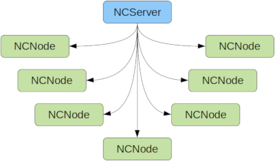

# Node Crunch

Allows to distribute computations across several nodes.
(Keywords: numeric computing, scientific computing, HPC)

## Table of contents

- [Node Crunch](#node-crunch)
  - [Table of contents](#table-of-contents)
  - [Features](#features)
  - [Introduction](#introduction)
  - [Server example](#server-example)
  - [Node example](#node-example)
  - [How to start the application](#how-to-start-the-application)
    - [Manually](#manually)
    - [Using SLURM / sbatch](#using-slurm--sbatch)
    - [Using PBS / Torque / qsub](#using-pbs--torque--qsub)
  - [Full working examples](#full-working-examples)
  - [How does it compare to *x* ?](#how-does-it-compare-to-x-)
    - [MPI](#mpi)
    - [BOINC](#boinc)
  - [TODO](#todo)
  - [FAQ](#faq)
  - [License](#license)

## Features

- 100% safe Rust.
- Easy to use API.
- If one of the nodes crashes the server and all other nodes can still continue with their work. (Internally heartbeat messages are used.)
- While running the user application more nodes can be added to speed up computation even more.
- The nodes can be a mixture of different OS and hardware achitecture. If it compiles it runs.

**Note 1:** *It is still in development and the API may change.*

**Note 2:** *The communication between the server and the nodes are not encrypted and there is no authentication, so use this in a trusted environment only!*

## Introduction

Node Crunch is a crate that allows users to write distributed code easily. The code is organized in a two main parts: one for the server and one for the node.

This is reflected in the two traits that must be implemented for Node Crunch to work:



1. The **NCSever** trait. This contains the functionality for the server. Here the data is split up for the nodes to do the computation and later the data is collected from all the nodes. The trait has five functions that have to be implemented accordingly:

    1.1 `initial_data()`
    This is called when a node contacts the server for the first time. Here the server internally assigns a new and unique node id and sends that back to the node together with an optional initial data. This only needs to be implemented when initial data has to be sent to each node before the main computation begins.

    1.2 `prepare_data_for_node()`
    After initializing the node it contacts the server again for some data to process. This method has to be implemented to prepare the data that will be send to the node.

    1.3 `process_data_from_node()`
    When the node is done with processing the data it will send the results back to the server. This method has to be implemented by the server code.

    1.4 `heartbeat_timeout()`
    Each node sends a heartbeat message internally to the server. If one of the node fails in sending this heartbeat message then this method is called. It has to be implemented in the server code and here the node should be marked as offline.

    1.5 `finish_job()`
    After all the data has been processed this method is called. Implement this method for example to write all the results to disk, etc.

2. The **NCNode** trait. This contains the functionality for each node. Here the most of the processing is done by the node code. The trait has two methods that have to be implemented accordingly.

    2.1 `set_initial_data()` When the node contacts the server for the first time the new node id is given to the node here along with some optional initial data. This method only has to be implemented when there is a need for some initial data.

    2.2 `process_data_from_server()` Here the main processing is done by the node code. This method receives the data that has to be processed and returns the processed data.

Both traits will be implemented for the user defined data structures that are passed to the starter for the server and the starter for the node.

## Server example

Here is a small example for the server:

```rust
struct MyServer {
    // ...
}

impl NCServer for MyStruct {
    // The method initial_data() doesn't have to be implemented if no initial data is needed.

    fn prepare_data_for_node(&mut self, node_id: NodeID) -> Result<NCJobStatus, NCError> {
        // ...
    }

    fn process_data_from_node(&mut self, node_id: NodeID, node_data: &[u8]) -> Result<(), NCError> {
        // ...
    }

    fn heartbeat_timeout(&mut self, nodes: Vec<NodeID>) {
        // ...
    }

    fn finish_job(&mut self) {
        // ...
    }
}

let server = MyServer {
    // ...
}

// The configuration is shared between server and node.
let configuration = NCConfiguration {
    // ...
    ..Default::default()
};

let mut server_starter = NCServerStarter::new(configuration);

match server_starter.start(server) {
    Ok(_) => {
        info!("Calculation finished");
    }
    Err(e) => {
        error!("An error occurred: {}", e);
    }
}

```

## Node example

Here is a small example for the node:

```rust
struct MyNode {
    // ...
}

impl NCNode for MyNode {
    // The method set_initial_data() doesn't have to be implemented if no initial data is needed.

    fn process_data_from_server(&mut self, data: &[u8]) -> Result<Vec<u8>, NCError> {
        // ...
    }
}

// The configuration is shared between server and node.
let configuration = NCConfiguration {
    // ...
    ..Default::default()
};

let node = MyNode{};
let mut node_starter = NCNodeStarter::new(configuration);

match node_starter.start(node) {
    Ok(_) => {
        info!("Calculation finished");
    }
    Err(e) => {
        error!("An error occurred: {}", e);
    }
}

```

## How to start the application

### Manually

Usually there is one binary for both the server and the node code. You just specify which mode is used for example via the command line.
For example we are using the switch "-s" to specify the server mode.
Since there is only one server and lots of nodes, the node mode should be the default:

```bash
./myapp -s & # option "-s" means run in server mode

./myapp & # start one task in node mode

./myapp & # start another task in node mode

./myapp --ip ip_of_server & # from a different computer

```

And in the main function a simple check does the job:

```rust
fn main() {
    // Read settings from command line or configuration file
    let options = get_option();

    if options.server {
        run_server(options);
    } else {
        run_node(options);
    }
}
```

### Using SLURM / sbatch

If you're using a HPC (high performance cluster) you will run new jobs through a job scheduler.
The mostly used one (at least in the [TOP500](https://www.top500.org/) list) is SLURM.

First start the server on one computer where the ip address is known:

```bash
./myapp -s & # again here "-s" means run in server mode
```

Then make sure that the binary is available on all the compute node in the same folder / path.
Now you can start multiple jobs using the job scheduler, in this case start 8 jobs:

```bash
for i in {1..8}; do sbatch run_single.sbatch; done
```

The batch file "run_single.sbatch" may look like this, we're using the command line option "--ip" to specify the ip address of the server:

```bash
#!/bin/bash -l
## Example run script for Node Crunch with SLURM

## General configuration options
#SBATCH -J Node_Crunch
#SBATCH -o node_crunch.%j.%N.out
#SBATCH -e node_crunch.%j.%N_Err.out
#SBATCH --mail-user=my_email@somewhere.com
#SBATCH --mail-type=ALL

## Machine and CPU configuration
## Number of tasks per job:
#SBATCH -n 1
## Number of nodes:
#SBATCH -N 1

# Ensure that all the binaries are availavle on all the cluster nodes at the same place.
# Usually this is done in the cluster setup via NFS or some other distributed
# filesystem already.

# change this to the actual ip address of the system where the server is running.
myapp --ip ip_of_server
```

### Using PBS / Torque / qsub

Other commonly used job scheduler are PBS or Torque. Again ensure that the binary is available on all compute nodes.
Then you can start multiple jobs (8 in this case):

```bash
for i in {1..8}; do qsub run_single.qsub; done
```

Here the file "run_single.qsub" may look like this:

```bash

```

## Full working examples

Using the two traits looks complicated at first but there are a couple of examples that show how to use it in "real world" applications:

- Distributed [Mandelbrot](examples/mandel1/), and [using rayon](examples/mandel2/)
- Distributed [Path Tracing](examples/path_tracing/)
- ...

## How does it compare to *x* ?

### MPI

[MPI](https://www.open-mpi.org/) (Message Passing Interface) is the gold standard for distributed computing. It's battle tested, highly optimized and has support for C, C++ and Fortran. There are also bindings for other programming languages available.
Node Crunch only works with Rust and is still in development.
Writing correct code in MPI is difficult and if one of the nodes crash all other nodes (including the main node) will be terminated. Node Crunch on the other hand doesn't care if one of the nodes crash. The heartbeat system detect if one of the nodes is no longer available and the server continues with the other nodes. Rust makes it very easy to write correct code, the user doesn't have to take care of synchronization and other things and can fully concentrate on the computing part.
The number of nodes in MPI is fixed the whole time once the application has started, whereas with Node Crunch you can add more and more nodes while it's running if needed.
Using MPI you are limited what kind of CPU / architecture / operating system you use when you want to run your application on a cluster. With Node Crunch you can mix different OS, CPUs and job scheduler as needed. You just have to compile the node code for each OS / hardware you want tu use.

### BOINC

[BOINC](https://boinc.berkeley.edu/) (Berkeley Open Infrastructure for Network Computing) is also used for distributed computing and is well tested and high-performance. Scientists use it to scale their computations massively by providing desktop clients that can run as screen savers on normal PCs, Macs, etc. It utilizes the resources that the computer is currently not using for numeric computations. The most famous (and first) application is the SETI@home client.
Node Crunch is a lot smaller but also a lot easier to set up ;-)

## TODO

You may have noticed that the data that is send around is passed as `&[u8]` or `Vec<u8>`. In the future this will be generic parameters that correspond to user defined data structures. For now the user has to de- / serialize all the data that is passed to and returned from the trait methods. But helper functions are provided in the `nc_utils` module.

Other things that need to be done in the next releases:

- Currently the communication between the server and the nodes are not compressed, not encrypted and there is no authentication. Maybe I'll switch to a small web framework that does all this, like [warp](https://github.com/seanmonstar/warp) for example. A web framework may be overkill but it would be very easy to add a nice web GUI for the server.

- The crate doesn't use any async code ([tokio](https://github.com/tokio-rs/tokio), [async-std](https://github.com/async-rs/async-std), ...). Computations usually are more CPU bound than IO bound but there are always exceptions to this. So the currently used thread based strategy will be the limiting factor in some cases.

- More helper functions and data structures have to be provided. These will show up when there are more use cases and I'm happy to include them when they make sense.

- And of course refactoring and adding more and better documentation is always good ;-)

## FAQ

- Where does the name come from ? Compute *node* and number *crunching*.
- Will you add feature *x* ? It depends, if it makes sense and helps other users as well.
- Can I use [Rayon](https://github.com/rayon-rs/rayon) and / or GPGPU with Node Crunch ? Yes of course, no problem. Have a look at the mandel2 example.

## License

This crate is licensed under the MIT license.
